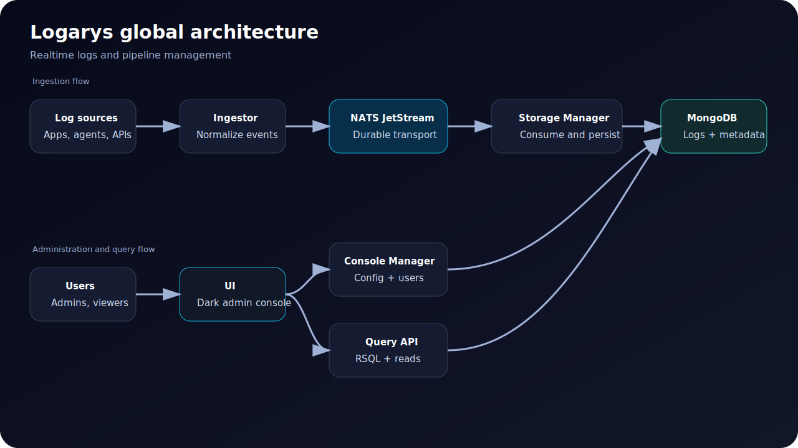

# Global architecture

Logarys uses a message-driven architecture to separate ingestion, persistence, querying, and administration.

## Schema



## Global flow

1. **Log sources** send events to the **Ingestor**.
2. The **Ingestor** validates, enriches, and normalizes the payload.
3. Normalized events are published to **NATS JetStream**.
4. The **Storage Manager** consumes messages from the broker.
5. The **Storage Manager** writes logs to **MongoDB**.
6. Users access the **UI**.
7. The **UI** calls the **Query API** to search logs.
8. The **UI** calls the **Console Manager** to manage pipelines and users.

## Main data paths

```txt
Source → Ingestor → NATS JetStream → Storage Manager → MongoDB
User → UI → Query API → MongoDB
Admin → UI → Console Manager → MongoDB
```

## Why this architecture?

- Ingestion is decoupled from storage latency.
- MongoDB supports flexible log schemas.
- Services can be scaled independently.
- Each container has a clear operational role.
